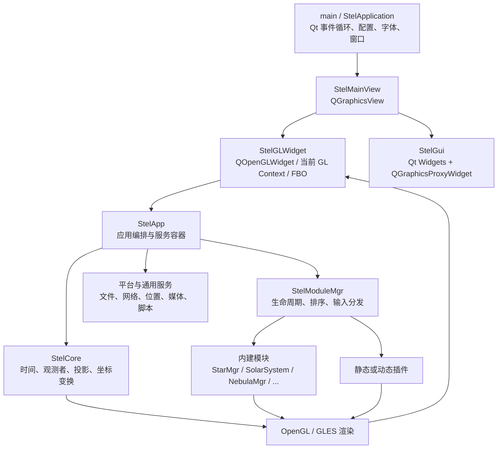
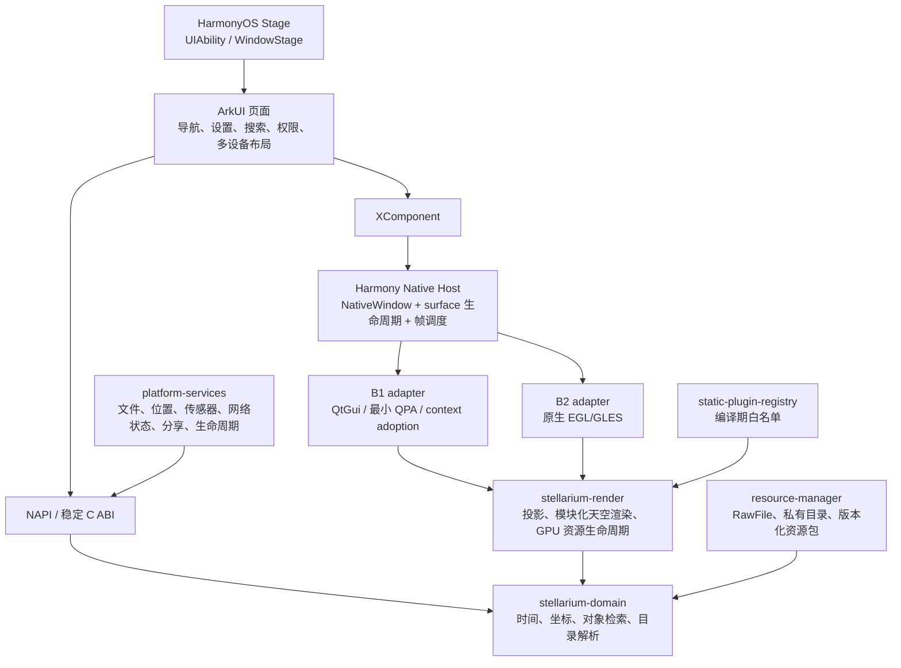

# Stellarium 26.1 适配 HarmonyOS 技术可行性报告

> 评估日期：2026-08-01  
> 评估对象：当前工作区中的 Stellarium 26.1 源码快照  
> 评估方法：GitNexus 架构图谱、全量源码与 CMake 静态核验、HarmonyOS/OpenHarmony/Qt 官方资料核验  
> 结论级别：方案立项前技术可行性评估，不替代目标真机上的 PoC、性能测试或法务审查

## 1. 执行摘要

### 1.1 总体结论

**Stellarium 适配 HarmonyOS 在技术上“有条件可行”（Conditional Go），但现有工程不能通过增加一个 toolchain 文件直接交叉编译成可发布的 HarmonyOS 应用。**

可复用价值很高的部分是天文计算、时间与坐标变换、星表/星云等数据解析、对象与模块模型，以及大部分已有 OpenGL ES 渲染逻辑；决定项目成败的不是这些领域代码，而是以下四个门槛：

1. 是否存在可在目标 HarmonyOS SDK/API 和真机上持续维护的 Qt 平台层，尤其是 Qt Widgets、QPA、`QOpenGLWidget`、QtNetwork 与字体/输入法支持。
2. 能否把当前由 `QOpenGLWidget` 隐式管理的 surface、FBO、帧循环和 GL context 生命周期可靠映射到 Stage 模型、XComponent 与 NativeWindow。
3. 能否把桌面文件系统假设迁移到 HarmonyOS 应用沙箱、RawFile/资源管理和版本化数据包。
4. 能否补齐触控、前后台、旋转/折叠、权限、位置和传感器等移动端平台行为。

因此，本报告给出以下分层决策：

| 决策项 | 建议 | 原因 |
|---|---|---|
| 直接承诺完整产品移植 | **No-Go** | 官方 Qt 支持矩阵未列 HarmonyOS；社区 Qt 移植仍有关键模块缺口，且当前代码深度耦合 Widgets/QOpenGLWidget |
| 开展 4–6 周技术 PoC | **Go** | EGL/OpenGL ES、Native C++、CMake、XComponent/NativeWindow 等基础能力具备，足以验证最关键不确定性 |
| PoC 通过后建设裁剪版 MVP | **Conditional Go** | 应以目标 API 真机结果、Qt fork 的维护责任和资源包策略为放行条件 |
| 长期产品架构 | **推荐“ArkUI 原生壳 + XComponent + C++ 引擎/平台适配层”** | 降低对非官方 Qt 平台层的长期锁定，同时保留高价值 C++ 核心与 GLES 渲染资产 |

### 1.2 推荐策略

采用“两阶段、带退出条件”的路线：

- **阶段 P0：双路径兼容性 PoC。** A-spike 使用 OpenHarmony SIG 的 Qt 分支验证 Widgets/QPA 路径；B-spike 独立验证 ArkUI/XComponent/NativeWindow/EGL、外部帧驱动和最小 Stellarium 绘制路径。目标 API 由产品设备矩阵确定；若产品选择 HarmonyOS 7（API 26），必须直接用相应 Huawei SDK 与真机验证，不能从社区分支默认值推定兼容。
- **阶段 P1：产品路线决策。** 若 Qt Widgets/QPA/GL 生命周期在真机上稳定，且团队能承担 Qt fork 维护，可用“完整 Qt 壳”快速交付裁剪版 MVP；若 A 失败，只有独立 B-spike 也通过后才能转入原生壳路线，不继续在桌面窗口体系上追加补丁。
- **阶段 P2：产品化。** 用 ArkUI 承担页面、权限、系统导航、设置、搜索、文件选择和多设备布局；用 XComponent 承载 C++ 星空引擎；所有插件改为编译期静态白名单。

这一路线不会把一次社区移植能否运行，误当成可持续的商业平台支持。

## 2. 评估范围、方法与限制

### 2.1 源码范围

当前快照的静态盘点结果如下：

| 项目 | 数量/规模 |
|---|---:|
| `src/ + plugins/` C/C++ 头文件与源文件 | 979 个 |
| `src/ + plugins/` C/C++ 总行数 | 约 65.45 万行（当前 `wc -l` 为 654,454） |
| `CMakeLists.txt` | 188 个 |
| Qt Designer `.ui` | 71 个 |
| QML 文件 | 0 个 |
| `plugins/` 一级插件目录 | 32 个 |
| 主要运行时数据目录 | 本地磁盘占用约 482 MiB（含 `scripts/`），不含约 589 MiB 的 `po/` 翻译源码目录 |

上述统计排除了 `build/` 与 `cmake-build-debug/` 构建产物。行数仍包含第三方、生成型和大规模系数/目录数据代码，不能直接换算工作量；`du` 的资源目录占用也不等于 HAP 压缩后的包体。

### 2.2 GitNexus 分析方法

工作区不含 `.git` 元数据，无法把结论绑定到原始提交号。为避免修改用户源码，评估在 `/tmp` 中建立了只用于分析的临时 Git 快照。

全仓图谱分析在宏密集 C++ 与大数据源码上触发了解析超时，因此采用“**20 个架构骨架文件的 GitNexus 聚焦图谱 + 全量源码交叉核验**”方式。分析工具为 GitNexus CLI 1.6.6。聚焦图谱包含：

- 1,861 个符号/实体节点；
- 3,263 条关系边；
- 53 个社区聚类；
- 167 条执行流。

这些数字只代表聚焦样本，不代表整个仓库的完整复杂度。GitNexus 主要用于识别跨文件主链和高耦合边界，所有关键判断随后都在完整源码树中逐行核验。

GitNexus 揭示的关键聚类和执行流包括：

- 初始化聚类：`StelGLWidget::initializeGL → StelMainView::init → StelApp::init`；
- 诊断流：`initializeGL → StelMainView::init → processOpenGLdiagnosticsAndWarnings → dumpOpenGLdiagnostics`；
- 帧调度流：`StelMainView/fpsTimerUpdate → StelModuleMgr::update → generateCallingLists`；
- 插件聚类：`getPluginsList / loadPlugin / loadExtensions / StelFileMgr::listContents`；
- 文件系统聚类：`StelFileMgr::init / findFile / getCacheDir` 与配置、缓存及插件发现紧密关联。

### 2.3 评估限制

- 未执行 HarmonyOS 交叉编译或真机测试；本报告不能替代 PoC。
- 工作区没有 Git 提交信息；后续实施应固定 upstream commit、补丁集、HarmonyOS SDK 与 NDK 版本。
- OpenHarmony SIG 社区移植与华为商业 HarmonyOS SDK、签名和 AppGallery 上架兼容性不能画等号。
- 人力与周期是基于当前证据的工程量级估算，不是排期承诺；PoC 结束后必须重新估算。

## 3. 当前项目整体架构

### 3.1 主体分层



| 层 | 责任 | 主要代码证据 | HarmonyOS 复用判断 |
|---|---|---|---|
| 进程与启动 | Qt 资源初始化、`StelApplication`、配置、字体、窗口和事件循环 | `src/main.cpp:148-520` | 启动语义需改为 Stage/UIAbility；业务初始化可拆出复用 |
| 主视图/UI | `QGraphicsView + QOpenGLWidget + QGraphicsScene`，叠加 Widgets UI | `src/StelMainView.cpp:87-129, 646-703` | 完整 Qt 路线可尝试复用；原生壳路线需替换 |
| 帧循环 | QPainter native painting 中依次调用 `StelApp::update/draw` | `src/StelMainView.cpp:397-433` | 调度逻辑可复用，surface/FBO/context 管理必须适配 |
| 应用编排 | 创建核心服务、模块、网络缓存、媒体与插件 | `src/core/StelApp.cpp:469-801` | 大部分可复用，但需依赖倒置和移动配置 |
| 天文核心 | 时间、位置、投影、坐标变换和观察者状态 | `src/core/StelCore.hpp` | 高复用价值 |
| 模块系统 | 模块注册、调用顺序、更新/绘制/输入生命周期 | `src/core/StelModule.hpp:63-138`、`src/core/StelModuleMgr.cpp:37-320` | 可复用；插件策略应静态化 |
| 平台服务 | 文件、网络、定位、媒体、串口、脚本 | `src/core/StelFileMgr.cpp`、`src/core/StelLocationMgr.cpp` | 需逐项提供 HarmonyOS adapter |
| 数据资源 | 星表、星云、天空文化、大气、纹理和景观 | `data/`、`stars/`、`nebulae/` 等 | 格式可复用，打包和读取方式需重做 |

### 3.2 启动与首帧链路

`main()` 在创建 Qt 应用后初始化文件系统和配置，设置默认 GL format，创建并显示 `StelMainView`，最后进入 Qt 事件循环：

```text
main()
  → StelApplication(argc, argv)
  → StelFileMgr::init()
  → QSurfaceFormat::setDefaultFormat(...)
  → StelMainView(...).show()
  → app.exec()
```

其中关键证据为 `src/main.cpp:217-250, 404, 467-519`。`StelMainView` 创建 `StelGLWidget` 作为 `QGraphicsView` viewport（`src/StelMainView.cpp:696-703`）；GL 初始化后获取当前 `QOpenGLContext` 并创建 `StelApp`（`src/StelMainView.cpp:856-965`）。

这说明当前应用不是“独立渲染库 + 薄 UI”，而是窗口系统、Qt scene、GL context 与应用初始化相互嵌套。HarmonyOS 适配首先需要拆开这条链。

### 3.3 每帧更新与绘制

`StelRootItem::paint()` 断言当前 GL context 正确，进入 QPainter native painting 后调用：

```text
StelApp::update(delta)
  → StelModuleMgr 按 ActionUpdate 顺序调用模块 update()

StelApp::draw()
  → StelCore::preDraw()
  → StelModuleMgr 按 ActionDraw 顺序调用模块 draw()
  → 后处理/渲染缓冲
  → StelCore::postDraw()
```

代码入口见 `src/StelMainView.cpp:397-433`、`src/core/StelApp.cpp:837-863, 1108-1143` 和 `src/core/StelModuleMgr.cpp:37-78, 208-225`。

适配时可以保留模块排序和 `update/draw` 协议，但必须新增显式的 `surfaceCreated/surfaceChanged/surfaceDestroyed`、`pause/resume`、context loss 与 GPU 资源重建协议。

### 3.4 插件架构

`StelModuleMgr` 同时支持：

- `QPluginLoader::staticInstances()` 的静态插件；
- 桌面平台的模块目录扫描；
- Android 应用目录中的 `libmodule_*.so` 动态扫描。

证据见 `src/core/StelModuleMgr.cpp:227-304`。构建系统和 `StelApp` 已有静态插件注册/导入路径（`src/CMakeLists.txt:465-478`、`src/core/StelApp.cpp:115-240`），因此 HarmonyOS 不需要保留运行时 `.so` 发现机制。**静态白名单是风险最低的发布策略。**

### 3.5 当前移动端能力的实际边界

仓库只有 Android 移动端壳：

- `android/AndroidManifest.xml` 使用 `QtApplication`/`QtActivity` 并声明网络、存储和位置权限；
- `src/main.cpp:234-247` 使用 JNI/Qt Android 私有接口请求全文件访问；
- `src/CMakeLists.txt:583-617` 设置 Android package source 和 native target；
- `src/core/StelFileMgr.cpp:111-118` 增加 `assets:` 与 Android 存储路径；
- `src/core/modules/StarMgr.cpp:521-531` 在 Android 上关闭星表 mmap；
- `src/core/StelOpenGL.hpp:38-59` 已有 GLES/`QOpenGLExtraFunctions` 分支。

没有 iOS、WASM/Emscripten 或 HarmonyOS 平台分支；没有 QML 移动 UI；触控/捏合的实际事件处理仅在 `Q_OS_WIN` 分支启用（`src/StelMainView.cpp:369-372, 500-549`）；没有 QtSensors/加速度计/陀螺仪/磁力计代码；也没有完整的移动前后台与 GL context 重建实现。仅在开启 `OPENGL_DEBUG_LOGGING` 时才连接并编译 `contextDestroyed()`，而该回调也只记录日志；常规构建没有 context-destroy 恢复处理（`src/StelMainView.cpp:858-882, 1592-1602`）。

因此，Android 代码可以作为 GLES、资源与静态插件的参考，但不能作为成熟移动产品架构直接复制。

## 4. HarmonyOS 与 Qt 兼容性基线

### 4.1 原生平台能力提供了可验证的承载路径

OpenHarmony 官方资料表明，开源底座提供 Native C/C++ NDK、XComponent、NativeWindow、RawFile、位置和传感器等能力；当前推荐样例展示了 ArkTS `XComponentController` surface 生命周期、NativeWindow 与 EGL/OpenGL ES 的衔接。[O5][O6][O7][O8][O11][O12][O13]

华为 HarmonyOS 官方资料则独立说明了 Stage 模型、Hvigor/CMake native 构建和 Network Kit 等商业 SDK 能力。[O17][O18][O19] 这些证据足以支持开展原生承载 PoC，但不能证明社区 Qt patch 与某个商业 HarmonyOS API 版本已经兼容；最终结论仍须来自指定 Huawei SDK 和目标真机。

所以，本项目不存在“平台完全没有 C++ 或 OpenGL ES 能力”的根本障碍。主要不确定性位于 Qt 兼容层、既有桌面架构与具体 API/设备组合，而非天文算法本身。

### 4.2 Qt 官方支持状态

Qt 官方 Supported Platforms 页面明确说明：未列出的配置不属于 Qt Project 正式支持范围；其移动平台清单包含 Android 与 iOS，但未列出 HarmonyOS。[O1] Qt 的平台接入依赖 QPA，且 QPA 私有接口没有跨 Qt 版本的源码或二进制兼容保证。[O2]

这意味着采用 Qt for OpenHarmony 社区分支时，项目必须自行承担：

- Qt fork 固定、合并和安全修复；
- HarmonyOS SDK/API 升级后的兼容性；
- QPA、字体、输入法、剪贴板、窗口、OpenGL、TLS 等平台问题；
- Qt 与 Stellarium 上游同时演进产生的双重补丁成本。

### 4.3 OpenHarmony SIG Qt 的当前能力差距

截至本报告日期，OpenHarmony SIG Qt 的 `Alpha_v9` 标签（commit `044e71e63b15cf03067f61022d6e4b27e9cb8c21`）构建配置列出 Qt `5.15.12`、`5.15.17` 与 `6.5.6`，默认配置值为 OpenHarmony API 15、`arm64-v8a`。[O3][O4]

其当前 `script/configure.json` 与 Stellarium 依赖的冲突如下：

| Stellarium 当前要求 | 源码状态 | SIG Qt 5.15.17 | SIG Qt 6.5.6 | 影响 |
|---|---|---|---|---|
| Qt Core/Concurrent/Gui/Network/Widgets | 顶层 CMake 强制 | 主体具备，但真机质量待验证 | `qtbase` 路线可构建，真机质量待验证 | PoC 核心对象 |
| Qt Charts | 强制 | 未在 Qt5 skip 清单中，仍需实际构建验证 | 明确 skip | Qt6 当前无法原样配置 |
| Qt Positioning | 强制 | `qtlocation` 被 skip，Positioning 后端不可依赖 | 明确 skip | 必须改为可选并接原生定位 |
| Qt Svg/SvgWidgets | 强制 | 需构建验证 | 配置未明确跳过，但需验证 | UI 图标/控件风险 |
| QML/Qt Declarative | Qt6 开启脚本时强制 | 可关闭脚本 | 明确 skip | Qt6 必须关闭脚本或补齐模块 |
| Multimedia/Speech/WebEngine/SerialPort | 可选但默认多项开启 | 多项缺失/跳过 | 明确 skip 多项 | MVP 必须关闭 |

当前顶层 CMake 在 `CMakeLists.txt:605-620` 无条件要求 `Concurrent Gui Network Widgets Charts Positioning`，Qt6 还要求 `SvgWidgets`；而 `ENABLE_MEDIA`、`ENABLE_SPEECH`、`ENABLE_QTWEBENGINE`、`ENABLE_GPS`、`ENABLE_SHOWMYSKY`、`ENABLE_XLSX`、`ENABLE_SCRIPTING` 等默认开启（`CMakeLists.txt:408-519`）。所以**社区 Qt 工具链就绪也不等于当前 Stellarium 能直接 configure/build**。

### 4.4 HarmonyOS 与 OpenHarmony 的边界

本报告将 OpenHarmony SIG Qt 视为可研究的社区基础，不视为华为商业 HarmonyOS 的官方 Qt 支持。华为官方入口当前展示 HarmonyOS 7（API 26）新能力，而 SIG 配置的默认值是 OpenHarmony API 15；两套 API 标识不能简单按数字比较，也没有证据证明该社区配置已覆盖 API 26。[O9] 目标 API 应由产品与设备矩阵确定，并在相应商业 SDK、目标设备、签名证书和 HAP/App Pack 发布链路上重新验证，不能以 OpenHarmony 模拟器或默认配置编译成功代替产品准入。

## 5. 适配矩阵

| 子系统 | 现状 | 可复用度 | HarmonyOS 改造 | 风险 |
|---|---|---:|---|---|
| 天文计算/坐标/时间/投影 | C++/Qt 基础类型为主 | 高 | 隔离 UI、文件与单例依赖；建立引擎 API | 低–中 |
| 星表/星云/天空文化解析 | 成熟格式与目录数据 | 高 | 沙箱路径、RawFile/解包、版本化索引、低存储模式 | 中 |
| 模块调度 | `StelModule` + `StelModuleMgr` | 高 | 增加移动生命周期；仅保留静态白名单 | 中 |
| GLES 渲染 | 已有 Android/GLES 分支 | 中–高 | 对接 XComponent/NativeWindow/EGL；处理 FBO、context loss、驱动差异 | 高 |
| 主窗口与 UI | Widgets/QGraphicsView/Designer `.ui` | 低（原生路线）/高（完整 Qt 路线） | 完整 Qt 路线补 QPA；原生路线以 ArkUI 重建移动 UI | 关键 |
| 输入 | 鼠标/键盘为主，触控实现不完整 | 中 | 多指 pointer、捏合、惯性、系统返回、软键盘、可访问性 | 高 |
| 应用生命周期 | 桌面事件循环 | 低 | UIAbility、窗口阶段、前后台、surface 重建、内存压力 | 关键 |
| 文件与配置 | 桌面目录 + Android `assets:`/外部存储 | 中 | 私有 files/cache、RawFile、系统 picker/URI、原子升级 | 高 |
| 网络/TLS | QtNetwork、代理、300 MiB 默认磁盘缓存 | 中 | 验证 TLS/CA、IPv6、切网、代理；移动缓存限额 | 中–高 |
| 位置 | Qt Positioning + GPS/NMEA/GeoIP | 中 | 原生 C API/ArkTS bridge、权限与回调；保留手工位置 | 高 |
| 姿态传感器 | 当前不存在 | 无 | 新增加速度计/陀螺仪/磁力计融合及校准 | 中–高 |
| 媒体/语音 | Qt Multimedia/TextToSpeech | 低 | 首版关闭；后续以 OHAudio/原生媒体服务替换；压缩格式还需 AVCodec/播放器或自带解码器 [O16] | 高 |
| 插件 | 静态 + 运行时动态加载 | 中–高 | 静态白名单，禁止任意 `.so` 扫描 | 中 |
| 打包/发布 | 桌面包 + Android APK 壳 | 低 | Stage/HAP、Hvigor、签名、权限、隐私与 AppGallery | 高 |

## 6. 关键技术问题

### 6.1 Qt Widgets/QPA 是第一阻塞项

当前 UI 不是 Qt Quick，而是 `QGraphicsView + QWidget/QDialog + QGraphicsProxyWidget`。即使 Qt 社区分支能编译 `qtbase`，仍需验证窗口、字体、输入法、触控、弹窗、剪贴板、DPI、安全区和可访问性。Qt 官方文档也将 Widgets 定位为主要用于维护既有桌面应用，而把 Qt Quick 作为移动/嵌入式 UI 的主要技术方向。[O10]

判断标准不是“能显示窗口”，而是连续运行、旋转、前后台、软键盘和多尺寸设备上的稳定性。

### 6.2 `QOpenGLWidget` 与原生 surface 生命周期高度耦合

渲染逻辑直接依赖 `QOpenGLWidget` 当前 context 与默认 FBO，并在 QGraphicsScene 的 `paint()` 中穿插 QPainter native painting。HarmonyOS 原生承载面是 XComponent/NativeWindow，二者生命周期、缓冲队列和线程模型不同。

需要显式抽象：

```cpp
struct RenderSurfaceHost {
    void surfaceCreated(void* nativeWindow, int width, int height);
    void surfaceChanged(int width, int height, float density);
    void renderFrame(double deltaSeconds);
    void surfaceDestroyed();
    void pause();
    void resume();
};
```

该接口只是边界示意；真正实现必须规定 GL 线程归属、context 创建/共享、FBO 绑定、GPU 资源释放与重建顺序。

### 6.3 资源体量和路径模型不适合直接打包

`data/mainRes.qrc` 仅嵌入图标和少量 shader；星表、星云、天空文化、纹理等大部分内容依赖文件系统安装目录。`StelFileMgr::init()` 对未知平台会落入类 Unix `$HOME/.stellarium` 与 `INSTALL_DATADIR` 路径，并在找不到安装目录时致命退出（`src/core/StelFileMgr.cpp:50-178`）。

建议拆成：

- HAP 内最小启动集：字体、基础星表、默认文化、基础纹理、默认配置；
- 应用私有目录中的版本化数据包；
- 可选天空文化、高清纹理、景观和大型目录的按需下载；
- 校验和、断点续传、空间不足回滚和旧版本清理；
- 所有用户导入/导出通过系统文件选择或 URI，不扫描公共存储。

### 6.4 移动生命周期和 context loss 尚未实现

当前仅在 `OPENGL_DEBUG_LOGGING` 构建中连接 `contextDestroyed()`，其实现也只记录诊断信息；常规构建没有 context-destroy 恢复处理，也没有统一 `pause/resume`。这会产生前后台返回黑屏、纹理失效、悬空 GL 对象和耗电问题。

最低要求是为所有持有 GPU 对象的模块定义：

- CPU 数据与 GPU 数据分离；
- `releaseGpuResources()` 可重复调用；
- `recreateGpuResources()` 可在新 context 上恢复；
- surface 不可用时停止帧循环和网络驱动的 UI 更新；
- 恢复时重新计算 viewport、DPI、安全区和投影。

### 6.5 位置和姿态需要原生适配

`StelLocationMgr` 会尝试 `QGeoPositionInfoSource`，但现有 OS 权限/请求逻辑存在平台条件分支，且 SIG Qt 的 Positioning 不可作为当前可靠依赖（`src/core/StelLocationMgr.cpp:499-501, 944-1000, 1118-1125`）。HarmonyOS/OpenHarmony 有原生位置和传感器 C API，可通过 NAPI/C ABI 适配；实现仍须运行时探测 SystemCapability、实际硬件和授权状态，不能从 API 存在推导所有设备都具备传感器。[O11][O12]

MVP 可先提供“手工选择位置 + 原生一次定位”；设备指向天空的 AR 式姿态体验应列为后续功能，并单独处理磁偏角、姿态融合、传感器校准和滤波。

### 6.6 插件与高风险功能需裁剪

建议 MVP 关闭：

- Scenery3d：对 FBO、geometry shader 和纹理单元要求高；
- TelescopeControl、INDI、SerialPort：涉及外部进程/POSIX/串口；
- RemoteControl/RemoteSync：增加服务端、TLS 和后台网络面；
- Multimedia、Speech、WebEngine；
- 脚本与脚本控制台；
- ShowMySky、XLSX；
- Oculus、VTS 及所有非 MVP 桌面工具插件；
- 运行时动态插件加载。

`RemoteControl` 内含自带 HTTP/TLS 服务端路径，部分代码使用 `VerifyNone`；移动首版不应把这类服务端能力带入攻击面。

静态白名单是本项目为降低包结构、ABI、供应链和攻击面风险而选择的发布策略，并不表示平台绝对禁止应用自带 native `.so`。若后续确需动态加载，仍须专项验证 HAP 布局、动态链接 namespace、签名和 ABI 规则。

### 6.7 网络、缓存和后台行为需重新定标

`StelApp` 创建共享 `QNetworkAccessManager` 与默认 300 MiB 磁盘缓存（`src/core/StelApp.cpp:498-506`）。对移动端应：

- 把缓存上限降到可配置的小值，并响应系统清理；
- 验证系统 CA、TLS 版本、SNI、DNS、IPv6、代理、Wi-Fi/蜂窝切换；
- 统一插件网络入口，避免各插件各建 manager；
- 前后台停止非必要刷新与下载；
- 大资源下载使用明确的网络和存储策略。

## 7. 实施路线比较

| 路线 | 工程边界 | 复用特点 | 优点 | 主要风险 | 粗略团队/周期* | 判断 |
|---|---|---|---|---|---|---|
| A. 完整 Qt/QPA 兼容层 | Stage/UIAbility + native bridge 替换 OS 入口；保留 `main()` 中可抽取的初始化逻辑、Widgets、QGraphicsView、QOpenGLWidget 和 StelGui | 源码复用最高 | PoC 与功能对齐最快 | 依赖非官方 Qt；桌面 UI 移动体验弱；Qt/API 升级维护成本高 | A-spike 2–3 人/4–6 周；裁剪 MVP 5–7 人/4–6 月；产品质量约 7–10 月 | 适合验证或时间优先的过渡 MVP |
| B1. ArkUI 壳 + QtCore/QtGui 渲染 | ArkUI 负责页面；XComponent 下通过最小 QPA 或 native-context adoption 保留 Qt OpenGL 封装 | 天文核心高；渲染候选中–高；桌面 UI 不复用 | 比 A 更原生，渲染改写较少 | 仍依赖 QtGui/QPA fork，context adoption 可行性未证 | 6–8 人/8–12 月形成裁剪首版 | 可作过渡，须独立 B-spike |
| B2. ArkUI 壳 + 原生 EGL/GLES 渲染适配 | 替换 Qt OpenGL/FBO/QPainter glue，保留 shader、投影、绘制算法和模块逻辑 | 天文核心高；渲染候选中等，需 PoC | 长期减少 Qt 平台锁定，系统集成更清晰 | GL 抽象与叠加 UI 改造较大，图形回归成本高 | 7–9 人/10–15 月形成产品级首版 | **长期推荐** |
| C. ArkUI + 渲染/UI 全面重写 | 仅复用算法、格式、数据与部分模块 | 复用最低 | 架构最原生，长期包袱最小 | 图形一致性、功能回归与工期风险最大 | 8–12 人/12–18+ 月 | 仅适合明确的长期重构战略 |

\* 假设团队包含至少 2 名熟悉 Qt/OpenGL 的 C++ 工程师、2 名 HarmonyOS/ArkUI 工程师、测试与构建发布能力；不包含全插件、桌面等功能、全部语言和所有设备形态。现阶段估算置信度低，立项预算宜保留约 ±50% 区间，并在 PoC 后重估。

### 7.1 路线 A 的适用条件

仅当下列条件全部满足时，才建议把路线 A 用于产品 MVP：

1. 指定 Qt fork 在产品选定的 HarmonyOS SDK/API 和目标真机上稳定通过 Widgets、QOpenGLWidget、Network、字体和输入法测试；
2. Qt Positioning/Charts 等缺失模块已从强制依赖中移除或被可靠替代；
3. 有明确团队/供应商负责 Qt fork、安全修复和 SDK 升级；
4. 产品接受首版 UI 更接近桌面版而非原生 HarmonyOS 体验；
5. 能建立 context loss、前后台和资源包的自动回归。

若任一项不成立，不应继续用大量平台条件编译“硬顶”路线 A。

### 7.2 路线 B 的推荐目标架构

路线 B 不是单一实现：B1 保留 QtGui/OpenGL 封装，因此仍需最小 QPA 或可靠的 native context adoption；B2 直接接管 EGL/GLES，需要替换 Qt GL/FBO/QPainter glue，但仍可保留 shader、投影、绘制算法和模块逻辑。只有 B2 才能实质降低对 Qt 平台 fork 的长期依赖。



建议边界：

- `stellarium-domain`：尽可能只依赖 QtCore 或进一步收敛为标准 C++；不持有窗口、QWidget、QNetworkAccessManager。
- `stellarium-render`：接收外部 surface/context/viewport，不创建桌面窗口；保留 `StelModule` 调度思想。B1 可暂留 Qt OpenGL 类，B2 则以 native GL adapter 替换。
- `platform-services`：以接口注入文件、位置、传感器、网络状态、剪贴板、分享和生命周期。
- `harmony-host`：ArkTS、UIAbility、XComponent、NAPI、权限和 HAP/Hvigor。
- `plugin-registry`：生成式静态注册表，不扫描或下载 native 插件。

## 8. 建议的工程改造清单

### 8.1 构建系统

1. 新增 `cmake/platform/HarmonyOS.cmake` 或等价平台模块，显式固定 SDK、NDK、API、ABI、Clang 和 libc++。
2. 新增 `STELLARIUM_PLATFORM_HARMONYOS` 能力开关，不把未知平台误判为 Linux。
3. 把当前无条件的 `Charts`、`Positioning`、`SvgWidgets` 依赖改为按功能选择。
4. 将 `stellarium-domain`、`stellarium-render` 与 desktop UI 目标分开，避免 `NO_GUI` 仍间接拉入 Widgets。
5. 为 HarmonyOS 生成 ARM64 shared library 和 Stage/HAP 工程；不要沿用桌面 executable 安装逻辑。
6. 只编译静态插件白名单，并生成明确的软件物料清单（SBOM）。

构建基线还必须验证项目的 C++17 要求、libc++、musl 行为、文件权限和第三方 native 库 ABI；不能把“多数 POSIX API 可用”推导为桌面 Linux 二进制/路径语义兼容。[O21][O22]

PoC 建议起始配置：

```text
-DENABLE_MEDIA=OFF
-DENABLE_SPEECH=OFF
-DENABLE_QTWEBENGINE=OFF
-DENABLE_GPS=OFF
-DENABLE_SHOWMYSKY=OFF
-DENABLE_XLSX=OFF
-DENABLE_INDI=OFF
-DENABLE_SCRIPTING=OFF
-DENABLE_PODIR=OFF
```

这些开关本身仍不足以让现有工程直接通过 HarmonyOS configure：顶层依赖尚需可选化。当前 `STELLARIUM_GUI_MODE=None` 只排除部分标准 GUI 源并换用 dummy GUI，仍会构建 `StelMainView/QGraphicsView/QOpenGLWidget`，且继续链接 Widgets、OpenGL、Charts、Positioning 和 Svg；**只有先完成目标拆分与依赖可选化后，原生壳的引擎目标才可使用该选项。**

此外应显式关闭 Scenery3d、TelescopeControl、RemoteControl/RemoteSync、Oculus、VTS 等插件，而不是依赖平台上“恰好找不到依赖”后自动失败。

### 8.2 引擎和渲染

1. 从 `StelMainView` 抽出帧入口、viewport 和输入 DTO。
2. 消除渲染模块对 `QOpenGLWidget::defaultFramebufferObject()` 等隐式状态的假设。
3. 建立 GL 能力表；基础版要求 GLES 2.0 可回退，高画质以 GLES 3 为首选。
4. 为每类 GPU 对象实现幂等释放和重建。
5. 将屏幕密度、安全区、方向和折叠状态作为显式输入。
6. 为 shader 建立目标 GPU/驱动的编译与截图回归集合。

### 8.3 UI 与输入

1. MVP 用 ArkUI 重建主屏、时间控制、搜索、位置、基础显示开关和设置。
2. 输入桥接至少覆盖按下/移动/抬起、pointer ID、多指缩放、取消事件和系统返回。
3. 不直接照搬桌面浮窗、右键和 hover 交互。
4. 在手机、平板、横竖屏和大字体下定义布局与可访问性基线。

### 8.4 平台服务

1. `FileService`：应用私有 files/cache/preferences、RawFile、系统 picker/URI、磁盘余量。
2. `LocationService`：权限、一次定位、持续定位、超时和手工回退。
3. `OrientationService`：后续接入加速度计/陀螺仪/磁力计并提供融合姿态。
4. `LifecycleService`：active/inactive/background/termination、surface 和内存压力。
5. `NetworkService`：网络状态、大文件下载、TLS/CA、缓存配额。
6. `ShareService`：截图、导入/导出和系统分享。

## 9. MVP 范围建议

### 9.1 纳入 MVP

- 实时星空、恒星、太阳系、基础星云和星座；
- 时间调节、基础投影和视场缩放；
- 对象搜索与选中信息；
- 手工位置与一次原生定位；
- 触控拖动和双指缩放；
- 基础设置、本地化与截图；
- 基础数据包和至少一种按需资源包；
- HTTPS 资源访问、前后台恢复和崩溃诊断。

### 9.2 不纳入首版

- Scenery3d、ShowMySky 高级大气；
- TelescopeControl/INDI/SerialPort；
- RemoteControl、RemoteSync 与本地服务端；
- 媒体、语音、WebEngine；
- 脚本、脚本控制台和运行时插件；
- Oculus/VTS 及桌面管理工具；
- 设备指向天空的高精度姿态模式，除非另设传感器专项。

范围纪律比“尽量把桌面功能都打开”更能降低首版失败概率。

## 10. 4–6 周 PoC 计划与放行门槛

建议用 3–4 名工程师并行执行 A-spike 与 B-spike。A 失败只能判定完整 Qt 路线不可行，不能自动证明原生 host 可行；B 必须通过自己的 surface、帧驱动、线程和 context 生命周期验证。

### 10.1 计划

| 周期 | 目标 | 主要产物 |
|---|---|---|
| 第 1 周 | 由设备矩阵固定产品 API，打通最小 Native C++/HAP 工程 | SDK/NDK manifest、可签名空壳 HAP、ARM64/C++17/libc++/musl ABI 记录、CI 构建 |
| 第 1–2 周 | A-spike：裁剪 CMake 并验证 Qt fork/Stage 入口 | 最小 Qt/Stellarium `.so`、缺失模块与补丁清单、QPA/bridge 日志 |
| 第 2–3 周 | A-spike 第一帧；B-spike 独立接通当前推荐 ArkTS XComponent/NativeWindow/EGL | Qt 首帧结果；native surface、外部帧驱动、代表性 Stellarium shader/绘制结果 |
| 第 3–4 周 | 两条路径分别验证输入、线程、旋转、前后台与 context loss | 拖动/缩放、NAPI/GL 线程模型、surface/GPU 资源重建日志 |
| 第 4–5 周 | 沙箱资源、配置、HTTPS 与位置 | 版本化资源目录、TLS 真机结果、手工/原生位置 |
| 第 5–6 周 | 稳定性、性能画像和发布链验证 | A/B 独立 Gate 结果、测试报告、风险重估、路线决策材料 |

### 10.2 必须通过的 Go/No-Go 门槛

| Gate | 通过标准 | 失败后的决策 |
|---|---|---|
| C-G1 构建发布 | 在产品选定的 Huawei SDK/API ARM64 工具链上可重复构建、签名并安装 HAP；C++17、libc++、musl 与第三方 `.so` ABI 已验证 | 公共 Gate，未解决则整体 No-Go；若目标为 API 26，必须直接使用相应 SDK/真机 |
| A-G1 Qt 依赖 | Qt fork 可构建所需 qtbase/Widgets/Network/Svg；Charts/Positioning 等已可选或替换 | A 路线 No-Go，不对 B 作结论 |
| A-G2 Qt 首帧/UI | QPA、Widgets、QOpenGLWidget、字体和输入法在至少两档目标真机稳定 | A 路线 No-Go；仅当 B-G1 已通过时才考虑 B |
| B-G1 原生 host | 当前推荐 XComponent/NativeWindow 路径可外部驱动代表性 Stellarium 绘制；NAPI/GL 线程、surface/context loss 明确 | B1/B2 路线 No-Go，不对 A 作结论 |
| C-G2 图形与生命周期 | 按目标设备协商的 GLES 版本稳定首帧（优先 ES3，并验证需要时的 ES2 降级）；连续 20 次前后台与旋转/窗口重建无黑屏、崩溃和持续泄漏 | 对未通过的具体路线 No-Go |
| C-G3 资源 | 不依赖公共目录扫描即可读取基础星表；升级/空间不足可恢复 | 重做资源包后再评估，不进入功能开发 |
| C-G4 输入与 UI | 单指拖动、双指缩放、系统返回、软键盘和安全区可用 | A 不合格不代表 B 合格；分别复测 |
| C-G5 网络 | HTTPS、系统 CA、DNS/IPv6、切网和缓存目录在真机通过 | 替换/修复网络 backend 后再放行 |
| C-G6 维护性 | A 有 Qt fork owner；B 有 GL adapter/context 生命周期 owner；版本锁和 CI 明确 | 缺少责任方的路线不得产品化 |

建议至少在一台中端手机和一台大屏/平板设备上验证；若目标还包含折叠屏或 PC 形态，应新增独立设备矩阵。

## 11. 测试与验收建议

### 11.1 功能与正确性

- 用桌面参考版本对同一时间、位置、投影和视场做截图差分；
- 对太阳、月球、行星、恒星和坐标转换建立数值 golden tests；
- 验证时区、夏令时、系统语言和中文字体；
- 验证资源升级、断点下载、校验失败、存储不足和离线模式。

### 11.2 图形与性能

- 收集 CPU/GPU 帧时，而不只看平均 FPS；记录 P50/P95/P99；
- 测试低/高画质、不同分辨率、横竖屏和热降频；
- 记录首帧时间、峰值内存、稳定态内存、GPU 资源重建耗时和耗电；
- 对常见目标 GPU 建 shader 编译与关键场景截图基线；
- 连续运行 30 分钟，并执行前后台、锁屏、旋转和内存压力组合测试。

具体性能阈值应在 PoC 首轮测量后按目标机型设定，不应在没有真机基线时承诺桌面同等画质。

### 11.3 平台与发布

- 权限拒绝、仅本次允许、永久拒绝后的降级路径；
- 无网、弱网、IPv6-only、系统时间改变和证书异常；
- HAP/App Pack、签名、升级安装、数据保留、卸载重装；
- 隐私清单、位置用途说明、第三方组件清单和开源许可展示。

## 12. 风险登记表

| 风险 | 概率 | 影响 | 等级 | 缓解措施 |
|---|---:|---:|---:|---|
| 社区 Qt for OpenHarmony 非官方且模块不全 | 高 | 极高 | 关键 | 4–6 周 A-spike；固定 fork；明确维护 owner；并行做独立 B-spike |
| `QOpenGLWidget`/QPA 与 XComponent 生命周期不稳定 | 高 | 极高 | 关键 | 首帧、context loss、前后台作为 Gate，不后置 |
| Qt6 缺 Charts/Declarative/Positioning 等 | 高 | 高 | 关键 | CMake 可选化；首版关闭脚本；原生位置；评估 Qt5 仅用于 PoC |
| 桌面 Widgets UI 在移动端不可用 | 高 | 高 | 高 | ArkUI 重建高频路径；完整 Qt 仅作过渡 |
| 约 0.5 GiB 运行时资源导致包体/存储压力 | 高 | 高 | 高 | 最小包、版本化资源包、按需下载、低存储模式 |
| GL 驱动/shader 差异 | 中–高 | 高 | 高 | GPU 矩阵、能力降级、截图回归、首版关闭 Scenery3d |
| 前后台/context loss 导致黑屏或泄漏 | 高 | 高 | 关键 | 显式 GPU 生命周期、压力回归、Gate G4 |
| 插件动态加载/后台服务与平台策略冲突 | 高 | 中–高 | 高 | 静态白名单；首版关闭服务端和硬件插件 |
| TLS/CA/网络切换兼容性 | 中 | 高 | 高 | 真机网络矩阵；统一网络层；缓存限额 |
| Qt、HarmonyOS、Stellarium 三方升级漂移 | 高 | 高 | 高 | 锁版本、补丁队列、持续集成、季度升级演练 |
| GPL/Qt 许可与商店分发义务处理不完整 | 中 | 高 | 高 | 上架前开源合规与法务审查、源码/NOTICE/SBOM 流程 |
| 当前快照无 Git 提交信息 | 高 | 中 | 中 | 实施前建立可复现基线和依赖锁文件 |

## 13. 许可证与合规注意事项

源码文件头和 `CMakeLists.txt:1022` 表明 Stellarium 按 **GNU GPL v2 或以后版本**分发；仓库 `COPYING` 包含 GPL v2 正文。社区 Qt 配置使用 LGPL 标签，但实际采用的 Qt 模块、静态/动态链接方式、补丁分发、第三方库和资源各有许可条件。

产品发布前至少应完成：

- Stellarium 修改源码与相应构建材料的提供方式；
- Qt LGPL/GPL 或商业许可选择及重链接义务评估；
- 所有插件、字体、天空文化、模型、纹理和数据集的逐项许可清单；
- HAP 内 NOTICE、许可证入口、源码获取说明与 SBOM；
- AppGallery 隐私、位置权限、网络内容与签名要求核验。[O20]

本节是工程风险提示，不构成法律意见。

## 14. 最终建议

1. **批准一个严格限时的 4–6 周 PoC，不批准立即承诺完整移植。**
2. PoC 并行验证 A 的 Qt/QPA/Widgets 链和 B 的 XComponent/native EGL 链，而不是先迁移大量业务功能。
3. 把当前强制 Qt 模块可选化，并先建立 `stellarium-domain`、`stellarium-render`、`platform-services` 三条边界。
4. 产品长期目标采用 **B2：ArkUI 原生壳 + XComponent + native GL adapter + C++ 引擎 + 静态插件白名单**；B1 只能作为仍依赖最小 QtGui/QPA 的过渡方案。
5. 若公共 Gate 与 A-G1/A-G2 全部通过，可用 A 交付裁剪 MVP；A 失败后，只有 B-G1 和公共 Gate 独立通过才能进入 B，不能把 A 失败本身当成 B 可行的证据。
6. 在 PoC 结束时，用真机数据重新给出性能预算、资源包大小、功能范围、团队配置与正式排期。

综合判断：**核心技术可迁移、产品形态需重构、平台层风险高但可通过前置 PoC 管理。** 这不是低成本移植项目，而是一个“保留天文与渲染资产、重建移动平台承载层”的中大型工程。

## 15. 主要外部资料

以下资料均于 2026-08-01 核验：

- [O1] [Qt 6 Supported Platforms][O1]
- [O2] [Qt Platform Abstraction (QPA)][O2]
- [O3] [OpenHarmony SIG — Qt 仓库][O3]
- [O4] [SIG Qt 构建配置 `script/configure.json`][O4]
- [O5] [OpenHarmony Native C/C++ NDK 概览][O5]
- [O6] [XComponent Native API 指南][O6]
- [O7] [NativeWindow 指南][O7]
- [O8] [OpenHarmony 当前推荐的 ArkTS XComponent/NativeWindow/EGL 样例][O8]
- [O9] [华为 HarmonyOS 开发者入口（当前 API 版本）][O9]
- [O10] [Qt 框架与 UI 技术说明][O10]
- [O11] [OpenHarmony 原生位置 API 指南][O11]
- [O12] [OpenHarmony 原生传感器 API 指南][O12]
- [O13] [RawFile 资源访问指南][O13]
- [O14] [Stage 模型应用包结构][O14]
- [O15] [OpenHarmony HAP 包说明][O15]
- [O16] [HarmonyOS OHAudio 播放指南][O16]
- [O17] [HarmonyOS Hvigor/CMake native 构建配置][O17]
- [O18] [HarmonyOS Stage 模型][O18]
- [O19] [HarmonyOS Network Kit][O19]
- [O20] [华为应用市场开发与发布入口][O20]
- [O21] [OpenHarmony musl 接口说明][O21]
- [O22] [NDK libc 文件接口与权限说明][O22]

[O1]: https://doc.qt.io/qt-6/supported-platforms.html
[O2]: https://doc.qt.io/qt-6/qpa.html
[O3]: https://gitcode.com/openharmony-sig/qt
[O4]: https://gitcode.com/openharmony-sig/qt/blob/Alpha_v9/script/configure.json
[O5]: https://gitcode.com/openharmony/docs/blob/master/en/application-dev/napi/ndk-development-overview.md
[O6]: https://gitcode.com/openharmony/docs/blob/master/en/application-dev/ui/napi-xcomponent-guidelines.md
[O7]: https://gitcode.com/openharmony/docs/blob/master/en/application-dev/graphics/native-window-guidelines.md
[O8]: https://gitcode.com/openharmony/applications_app_samples/tree/master/code/BasicFeature/Native/ArkTSXComponent
[O9]: https://developer.huawei.com/consumer/cn/information/releases
[O10]: https://doc.qt.io/qt-6/qt-intro.html
[O11]: https://gitcode.com/openharmony/docs/blob/master/en/application-dev/device/location/location-guidelines-capi.md
[O12]: https://gitcode.com/openharmony/docs/blob/master/en/application-dev/device/sensor/sensor-guidelines-capi.md
[O13]: https://gitcode.com/openharmony/docs/blob/master/en/application-dev/napi/rawfile-guidelines.md
[O14]: https://gitcode.com/openharmony/docs/blob/master/en/application-dev/quick-start/application-package-structure-stage.md
[O15]: https://gitcode.com/openharmony/docs/blob/master/en/application-dev/quick-start/hap-package.md
[O16]: https://developer.huawei.com/consumer/cn/doc/harmonyos-guides-V5/using-ohaudio-for-playback-V5
[O17]: https://developer.huawei.com/consumer/cn/doc/harmonyos-guides-V5/ide-hvigor-build-profile-V5
[O18]: https://developer.huawei.com/consumer/cn/arkui/arkui-stage/
[O19]: https://developer.huawei.com/consumer/cn/doc/harmonyos-guides/network-kit-network-connecttion
[O20]: https://developer.huawei.com/consumer/cn/appgallery/devstart/
[O21]: https://gitcode.com/openharmony/docs/blob/master/en/application-dev/reference/native-lib/musl.md
[O22]: https://gitcode.com/openharmony/docs/blob/master/en/application-dev/reference/native-lib/guidance-on-ndk-libc-interfaces-affected-by-permissions.md
